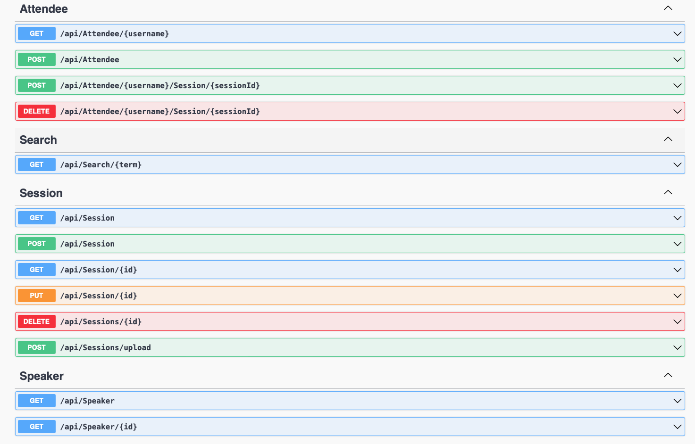

# Hack Technology / Project Attempted

## What you built?

I built a full-featured ASP.NET Core conference application following an online tutorial. This includes an API back-end application, a web front-end application, and a common library for shared data transfer objects.

### Frontend

### Backend (API endpoints)

### High-level architecture

## Who Did What?

This was an individual project, as such I did all the work.

## What you learned

- Learned how to build a full-stack web application using C#, Entity Framework, minimal APIs, and Razor templating engine.
- Learned how to use the dotnet CLI to create, run, and manage .NET projects.
Authentication and authorization topics were confusing, need more research.

## Why .NET for final project?

- C# and .NET are popular choices for building high-performance web applications.

## Authors

Lekina Rorat

## Acknowledgments

Link to source tutorial [here](https://github.com/dotnet-presentations/aspnetcore-app-workshop/tree/main).
